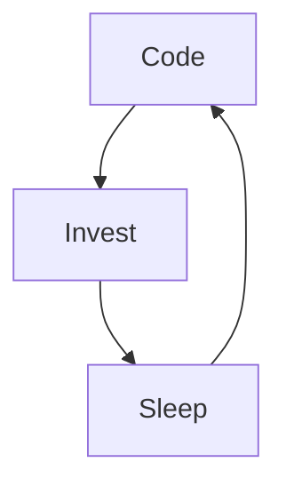

# Cyril VELLA 💻

Hi, I'm Cyril from France, living in Marseille 🇫🇷 and Korea 🇰🇷, fullstack web-developper, I am freelancer since 5 years and got a master degree of computer sciences. I really enjoy learning new frameworks and programming languages useful for increasing my productivity like Javascript, React, NodeJS, etc.

Bonjour, je suis Cyril! Je vis à Marseille et à Séoul, je suis développeur web fullstack & freelance depuis quelques années et j'ai un master en informatique en poche. J'adore me former à apprendre de nouveux outils utiles pour augmenter ma productivité tels que Javascript, React, NodeJS, etc.

### Languages and Tools:

[][youtubeplaylist]

[][youtubeplaylist]
[][youtubeplaylist]
[][youtubeplaylist]
[][youtubeplaylist]
[][youtubeplaylist]
[][youtubeplaylist]
[][youtubeplaylist]
[][youtubeplaylist]
[][youtubeplaylist]
[][youtubeplaylist]
[][youtubeplaylist]

 
 

### Connect with me:

&nbsp;&nbsp;

### My daily routine :

### ⭐ GitHub Stats

